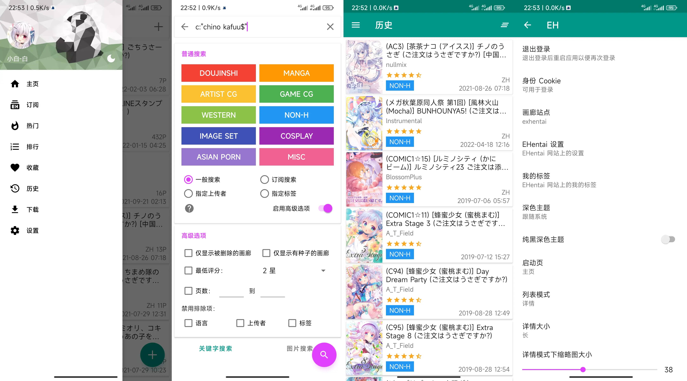

<h1 align="center">
  
   EhViewer-NekoInverter 
</h1>

  
  
  
  

  <h3>
    <a href="#描述">
    描述
    </a>
     | 
    <a href="#下载">
    下载
    </a>
     | 
    <a href="#链接">
    链接
    </a>
     | 
    <a href="#截图">
    截图
    </a>
     | 
    <a href="#感谢">
    感谢
    </a>
     | 
    <a href="#许可证">
    许可证
    </a>
  </h3>

# 描述

NekoInverter 版的 EhViewer [白E]，原作者已不再维护

由于本人水平不足，本分支不接受功能请求，如果您有什么好想法或者发现什么问题欢迎直接提交 PR，软件常见使用问题请参阅 [Q&A](https://github.com/EhViewer-NekoInverter/EhViewer/issues/18)

综上，如果您可以接受 MD3 风格，那使用 [彩E](https://github.com/Ehviewer-Overhauled/Ehviewer) 应该是更好的选择，我建立本仓库就是因为实在不能接受 MD3！不要大圆角！不要大色块！😡😡

# 下载

**注：需要 Android 9 及以上版本系统 (唯一一个支持 Android 6 的版本：[v1.7.27-final](https://github.com/EhViewer-NekoInverter/EhViewer/releases/tag/v1.7.27.final))**

推荐前往 [Github Actions](https://github.com/EhViewer-NekoInverter/EhViewer/actions/workflows/ci.yml) 下载最新 CI 版本，需要登录 Github 账号（可通过 [nightly.link](https://nightly.link/EhViewer-NekoInverter/EhViewer/workflows/ci/eh-1.7.28.x) 免登录下载）

也可以前往 [Github Releases](https://github.com/EhViewer-NekoInverter/EhViewer/releases) 下载发行版，无需登录账号，但可能不是最新的

# 链接

**EhViewer 各版本链接**

- Overhauled 版 [彩E，推荐使用]：[https://github.com/Ehviewer-Overhauled/Ehviewer](https://github.com/Ehviewer-Overhauled/Ehviewer)
- Epix 版 [绿E MOD，最接近原版]：[https://github.com/exzhawk/EhViewer](https://github.com/exzhawk/EhViewer)
- SXJ 版 [绿E新版，不推荐]：[https://github.com/xiaojieonly/Ehviewer_CN_SXJ](https://github.com/xiaojieonly/Ehviewer_CN_SXJ)
- ~~Hippo Seven 版 [绿E原版，半停更，最新 [1.7.8](https://t.me/ehviewer/2127118)]：[https://github.com/seven332/EhViewer](https://github.com/seven332/EhViewer)~~
- ~~NekoInverter 版 [白E，已停更，最新 [1.7.26.4](https://t.me/ehviewer/2029210)]：[https://gitlab.com/NekoInverter/EhViewer](https://gitlab.com/NekoInverter/EhViewer)~~

**其他 E-Hentai Viewer 链接**

- FEhViewer ``全平台``：[https://github.com/honjow/FEhViewer](https://github.com/honjow/FEhViewer)
- JHenTai ``全平台``：[https://github.com/jiangtian616/JHenTai](https://github.com/jiangtian616/JHenTai)
- Dai-Hentai ``iOS``：[https://github.com/DaidoujiChen/Dai-Hentai](https://github.com/DaidoujiChen/Dai-Hentai)
- EhPanda ``iOS``：[https://github.com/EhPanda-Team/EhPanda](https://github.com/EhPanda-Team/EhPanda)
- Shinsi2 ``iOS``：[https://github.com/LonelyRun/Shinsi2](https://github.com/LonelyRun/Shinsi2)
- E-Viewer ``UWP``：[https://github.com/OpportunityLiu/E-Viewer](https://github.com/OpportunityLiu/E-Viewer)
- Ehentai-QT ``桌面端``：[https://github.com/tonquer/ehentai-qt](https://github.com/tonquer/ehentai-qt)

**支持 E-Hentai 的聚合阅读器**

- Tachiyomi ``Android``：[https://tachiyomi.org](https://tachiyomi.org)
- Yealico ``iOS``：[https://apps.apple.com/cn/app/yealico/id1359000639](https://apps.apple.com/cn/app/yealico/id1359000639)

**E-Hentai 官方网站**

- [https://e-hentai.org](https://e-hentai.org)

# 截图

# 感谢

本项目受到了诸多开源项目的帮助

- [AOSP & AndroidX](https://source.android.com/)
- [android-advancedrecyclerview](https://github.com/h6ah4i/android-advancedrecyclerview)
- [material-components-android](https://github.com/material-components/material-components-android)
- [FullDraggableDrawer](https://github.com/PureWriter/FullDraggableDrawer)
- [GnuTLS](https://gnutls.org/)
- [jsoup](https://github.com/jhy/jsoup)
- [libarchive](http://www.libarchive.org/)
- [okhttp](https://github.com/square/okhttp)
- [RikkaX](https://github.com/RikkaApps/RikkaX)
- [roaster](https://github.com/forge/roaster)
- [TapTargetView](https://github.com/KeepSafe/TapTargetView)
- [XZ Utils](https://tukaani.org/xz/)

部分代码来源

- [Ehviewer-Overhauled](https://github.com/Ehviewer-Overhauled/Ehviewer)

标签翻译数据

- [EhTagTranslation](https://github.com/EhTagTranslation/Database)

# 许可证

本仓库原协议为 APL2.0，于 [#8cd551e](https://github.com/EhViewer-NekoInverter/EhViewer/commit/8cd551ecb8444abdd9642f30002c8a8fe7eec103) 变更为 GPL3.0

    Copyright 2014-2019 Hippo Seven
    Copyright 2020-2022 NekoInverter
    Copyright 2022-2023 Moedog, Tarsin Norbin, and other contributors

    EhViewer is free software:
    you can redistribute it and/or modify it under the terms of the GNU General Public License as published by the Free Software Foundation,
    either version 3 of the License, or (at your option) any later version.

    EhViewer is distributed in the hope that it will be useful, but WITHOUT ANY WARRANTY;
    without even the implied warranty of MERCHANTABILITY or FITNESS FOR A PARTICULAR PURPOSE.
    See the GNU General Public License for more details.

    You should have received a copy of the GNU General Public License along with EhViewer.
    If not, see <https://www.gnu.org/licenses/>.
